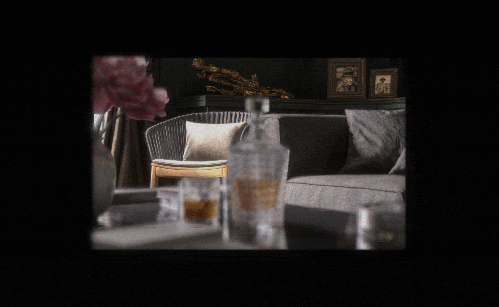

# Split-Lohmann Multifocal Displays [SIGGRAPH 2023]

[Yingsi Qin](https://yingsiqin.github.io/), [Wei-Yu Chen](https://wyharveychen.github.io/), [Matthew O'Toole](https://www.cs.cmu.edu/~motoole2/), [Aswin C. Sankaranarayanan](http://imagesci.ece.cmu.edu/)

This repository contains both (1) the wave-optics-based simulation code, and (2) the hardware display code, used for [Split-Lohmann Multifocal Displays](https://dl.acm.org/doi/abs/10.1145/3592110). 

If you use our code or dataset, please cite our paper:
```
@article{Qin_SplitLohmann,
author = {Qin, Yingsi and Chen, Wei-Yu and O'Toole, Matthew and Sankaranarayanan, Aswin C.},
title = {Split-Lohmann Multifocal Displays},
year = {2023},
issue_date = {August 2023},
publisher = {Association for Computing Machinery},
address = {New York, NY, USA},
volume = {42},
number = {4},
issn = {0730-0301},
url = {https://doi.org/10.1145/3592110},
doi = {10.1145/3592110},
abstract = {This work provides the design of a multifocal display that can create a dense stack of focal planes in a single shot. We achieve this using a novel computational lens that provides spatial selectivity in its focal length, i.e, the lens appears to have different focal lengths across points on a display behind it. This enables a multifocal display via an appropriate selection of the spatially-varying focal length, thereby avoiding time multiplexing techniques that are associated with traditional focus tunable lenses. The idea central to this design is a modification of a Lohmann lens, a focus tunable lens created with two cubic phase plates that translate relative to each other. Using optical relays and a phase spatial light modulator, we replace the physical translation of the cubic plates with an optical one, while simultaneously allowing for different pixels on the display to undergo different amounts of translations and, consequently, different focal lengths. We refer to this design as a Split-Lohmann multifocal display. Split-Lohmann displays provide a large \'{e}tendue as well as high spatial and depth resolutions; the absence of time multiplexing and the extremely light computational footprint for content processing makes it suitable for video and interactive experiences. Using a lab prototype, we show results over a wide range of static, dynamic, and interactive 3D scenes, showcasing high visual quality over a large working range.},
journal = {ACM Trans. Graph.},
month = {jul},
articleno = {57},
numpages = {18},
keywords = {multifocal displays, computational displays, vergence-accomodation conflict, lohmann lenses}
}
```

Visit the links below for more information:\
 [[Paper](https://dl.acm.org/doi/abs/10.1145/3592110)] [[Supplemental PDF](https://yingsiqin.github.io/assets/pdfs/SplitLohmann_SIGGRAPH23-supp.pdf)] [[Project Website](https://imaging.cs.cmu.edu/split_lohmann/)]\
 [[6-Minute Video](https://youtu.be/9lbg8qOCjUM)] [[3-Minute Video](https://youtu.be/0Z4W1DJO_nw)] [[10-Minute Talk @ SIGGRAPH 2023](https://youtu.be/1qH6yvEWd5c)]

## Getting Started

All simulation codes are in MATLAB. The simulation is based on wave optics.

### Run Simulation

To reproduce our simulation results, run `runsim.m` inside this folder.\
Running the code as-is produces the example focal stack result shown below, with fewer iterations.

### Simulation I/O
Input: they are `mat` files containing RGBD images loaded from the `scenes/` folder.\
Output: they are simulated focal stacks saved to the `results/` folder.

### Simulation Modes and Flags

Two simulation modes are available in `runsim.m`:
- `mode = 1`: coarse resolution, few iterations, quick and dirty *(takes 3 minutes)*
- `mode = 2`: fine resolution, more iterations, avoids aliasing *(takes 43 minutes)*

Each runtime is from a simulation for four camera focus settings, run on Apple M2 Max 96GB RAM. Reducing the number of camera focus images will speed up the runtime.

Two flags are available:
- `flags.color`: when `true`, simulates RGB channel content (using the same wavelength); when `false`, simulates the green channel only; default is `true`.
- `flags.quantization`: the simulation should *always run with this flag set to true*, otherwise only to replicate the Figure 6c in the paper; deafult is `true`.

### Example Focal Stack Result
The focal stack result below was generated using `100` propagation iterations; each initialized with a wavefront having a random phase at each point.

To obtain the most realistic output, increase the `sim.num_iter` number in `define_params.m`.\
Increasing this number will reduce the amount of speckle noise in the focal stack images.



## File Structure
### `functions/` Folder
This folder stores the simulation functions.
- `runsim.m`: top-level main wrapper program that defines simulation modes
- `define_params.m`: the file where all parameters are defined
- `load_scene.m`: the file where the texture and depth maps are read and resized
- `print_specs.m`: prints the essential simulation specifications to stdout
- `simulation.m`: child simulation program that prepares coordinates, samples the scene input files, quantize the depth map, and calls `render.m`
- `render.m`: propagates input field to the viewing sensor plane for `num_focus_images` times
- `lens_fourier_propagate.m`: performs a discrete optical Fourier Transform using `fft2`
- `interp_for_camera.m`: interpolates the intensity output for viewing coordinates
- `compile_gif.m`: compiles a gif file from a focal stack of images and saves the gif and png images

### `scenes/` Folder
This folder stores the mat and png scene files. All depth maps are in diopter space and scaled to `[0, 4]` diopter range for the simulation. The scene name is chosen in `runsim.m`.

- `mat/`: this is the folder where scene files are read.
    - `[scene name].mat`
- `png/`: this folder contains reference images for quick visualization.
    - `[scene name]_TextureMap.png`
    - `[scene name]_DiopterMap.png`

### `results/` Folder
This folder stores the `png` and `gif` focal stack results. The file names tell some of the identifying parameters specified in `functions/define_params.m`.

For example, `Whiskey-simRes_5um-numIter_20-quantize_1-hasColor_1.gif` is the focal stack output from a simulation with parameters 

    simulation resolution = 5.0um
    number of iterations = 20
    depth map quantization flag = true
    RGB color flag = true

### `hardware/` Folder

 If you are looking for our hardware code to display static and interactive scenes, go to this folder and visit `hardware/README.md`.

 This folder is self-contained.

## Scene Credits

If you use any of our provided scenes, please also credit the courtesy source of the 3D scene or asset.

- Whiskey scene: "Dark Interior Scene" 3D scene courtesy of “Entity Designer” at Blender Market.
- Motorcycle scene: 3D scene courtesy of the Middlebury 2014 Stereo Dataset [Scharstein et al. 2014].
- CastleCity scene: "Scanlands" 3D scene courtesy of Piotr Krynski at Blender Studio.
